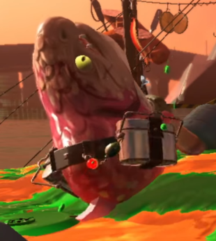

[回到首页](/salmonrun)

# splatoon2乌贼打工宝典（低阶篇）

欲练此功，必先买switch和splatoon2
作为一个为了打工买switch的工头（自封，打工估计也有1300小时了），有些经验和教训想分享给工友们，不但能提高通过率，更能让大家都体验丝滑温馨的打工环境。

本教程由浅入深的讲我知道打工的所有细节和技巧，可自行选择阅读的深度。

## 0基础篇
打工简单来说就是乌贼PVE，可以本地多人（我还没打过，只知道可以自选武器，也可以通过虚拟局域网的技术实现本地），大部分人都是在线等开工，打工作为乌贼对战的补充品，并不是7*24开工，要等开工才行，开工时间可以通过手机app，nintendo switch或者ikawidget2查看，或者开游戏看。

开始后将有三大波怪，每波100秒，胜利条件是每波都没全灭，并且运到指定数量以上的金蛋。

小怪掉鱼蛋，大怪掉金蛋，乌贼碰到金蛋会背在背后，到家的篮子旁边按a能交付，一次只能背一个蛋。

乌贼死了不会自动复活，会变成游泳圈，救了能原地满状态复活，并且有一段无敌时间（高难度有时候就靠互相救用无敌时间苟活）。

四个人的大招各有两个飞机，水枪，捶地，三角雷rush，所有人副武器都是三角雷。大招不用就浪费了，所以就算是清小怪也不亏。

打工会有级别和本次打工分数，级别高了难度也高，所有人都在同级别的时候才会涨级别评分，胜利+20，失败第一波-20，第二波-10，第三波不变，级别评分现在可以继承上次的，最多继承400。

很多人打工是为了低保，何谓低保，本次打工分数1200以内，每100都有一个扭蛋奖励，超过1200后奖励就相对少一些，奖励可以在打工门口左边的柜台领取，本次打工分数不论成功失败都是加，但是鱼蛋和金蛋数量会影响加分的多少，扭蛋可以累积，过了打工也可以领，但是最多累积99，满了再打就溢出没了，所以要记得领。 扭蛋根据颜色不同会有金钱、饮料、装备，细节我不是很关心。因为我本来就不是为了奖励才打工的，打工的装备是可以用在对战的（但是打工并不能换衣服，所有人都穿工作装）。

## 新人篇
刚开始打工的肯定总是死，打怪打不死，经常游泳圈，我认为打工最重要的就是存活，只要不死就有DPS，就能运蛋，就能分散敌人的注意力（有时候不是好事，后面会细讲）。

有个小技巧看水位的，开局屏幕下方有个阴影的波浪，看那个的绝对高度就能看出来这波的水位，尤其是退潮，很有用，尽早过去涂地，但是前一波涨潮，这波退潮不要着急跳，真的会淹死的。（4个水位敏感的工人一起淹死也是见过的）。

小怪分4种，普通，胖哥，小鱼，偷蛋贼，他们移动会涂地，并且绝大部分死亡都跟他们有关系，dps高的武器一定要多涂地，多打怪，没墨的重武器会被小鱼给虐死的。

大怪有垃圾桶，塔，绿帽，伞，车，食人鱼，蛇
### 垃圾桶

### 垃圾桶会开盖，闭盖的时候放可乐炸弹从天而降，右边会锁定最近的，所以如果单刷，先丢右边，可以安逸的再丢左边
击杀方式：
首选：每个桶丢一个三角雷， 
次选：高压水枪打桶连接处，飞机炸桶内
打炮：打桶里
注意：高难度可以只丢一边，原理是每个图每种boss最多3个
别称：导弹

### 塔

塔每隔一段时间放一次水枪，锁定离自己最远乌贼，被锁定的尽量别连累队友，不会躲的可以横向走路，不会被打中，存活第一。
击杀方式：塔是锅叠起来的，打掉所有的锅，
首选：小枪和泡泡类武器最好，捶地， 
次选：飞机炸中间，一炮死，或者水枪打，三角雷rush也能打
打炮：打中间只要一炮
别称：炊事班长，火锅

### 绿帽

绿帽会锁定一个最近的人，一直走近，进入它的射程，就会从头上生成一个绿色炸弹，然后丢出来爆炸。看到绿帽不要着急上去打，等它走近了再打好拿蛋。
击杀方式：
首选：主武器打长出来的绿帽， 最适合武器，竖拍重刷，狙，长枪，利用地形的小枪
次选：飞机炸刚生出来的绿帽，任何时候水枪打身体，生出绿帽的时候捶地
打炮：长出绿帽的时候炸身体
别称：炸弹，掐

### 伞

伞跳一次扫描一次最近的人，如果不在范围内，就会再跳一次，重复扫描，搜到人就打出雨弹，发射两次后继续跳，雨弹没被打掉的话会下雨，两个雨重合在一起极其容易杀死乌贼。不着急打，可以勾引回家。
击杀方式：
首选：打回雨弹能秒杀，如果雨弹没机会打回，可以勾引雨弹打向没人的方向，然后无视雨弹，强杀开伞的伞
次选：水枪贯穿杀伤，开伞的时候捶地，飞机，三角雷
打炮：开伞的时候打
注意：飞在空中也能打，能用1个雨弹炸别的伞
别称：萧敬腾

### 车

车会找最近的人，被攻击了以后会停一下，然后追攻击的人，持续打会停下，然后打屁股才能击杀。不着急打，勾引回家打。
击杀方式：
首选：一个人打吸引车的注意，然后调整车屁股到队友好攻击的方向，让其他队友打
次选：水枪贯穿串糖葫芦，三角雷、飞机、捶地打屁股
打炮：等车走近了轰正面（如果相信队友，可以放车回家，让拿蛋的打）
别称：老司机

### 食人鱼

食人鱼会一直潜水追最近的人，地上有个绿圈，然后吃人。这是最需要引回笼子击杀的怪，稳定3个蛋。
击杀方式：
首选：在绿圈里丢雷，食人鱼吃到三角雷会被秒杀
次选：食人鱼吃的时候武器攻击，一个人攻击一般3次能击杀，捶地会被吃掉所以千万不要捶地，水枪能打，但是不推荐
打炮：一般轮不到炮打食人鱼，不划算
注意：被追的尽量回家，如果看食人鱼不伸头就死了，说明你延迟大，重刷可以原地转圈杀鱼，一轮死
别称：爱，送温暖

### 蛇

蛇会随机追一个人，只有尾巴才能打
击杀方式：
首选：主武器打尾巴
次选：捶地秒杀，飞机和三角雷就多打几下，水枪也能打，就是难一点
注意：被追的老老实实的在家里等着，其他人趁机打尾巴，被追的左右晃，容易让蛇头护住尾巴
别称：龙

先这么多吧，太长了人也懒得看，有兴趣的再看下一篇吧。

[下一篇：高阶篇](/salmonrun/step-2/index.html)

